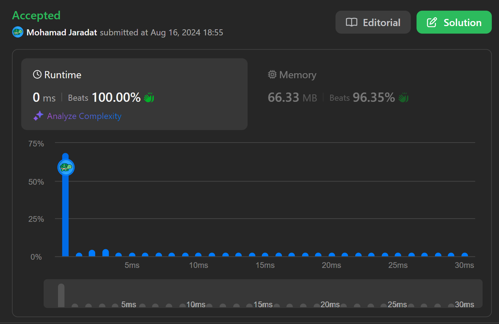
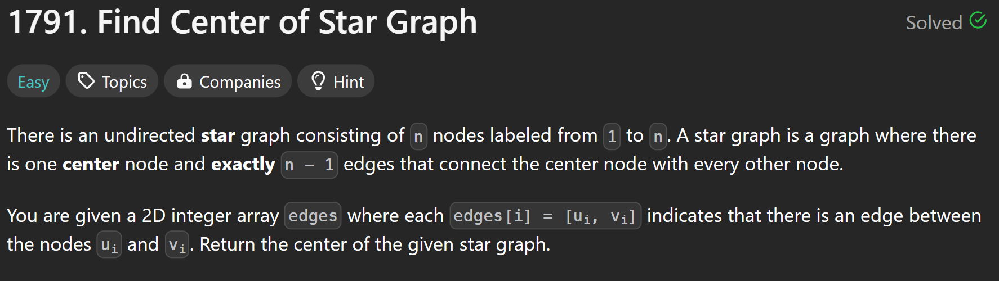

# Submission

# Problem Description


# Code
## Java Sample
```java
// I don't know why people are traversing around all the edges, the constraints are clear that there are NO edges
// between two NON-CENTRAL vertices. meaning that only the central vertex can be common between any two edges.
// We only need to return the first common vertex found between ANY two edges, and that vertex is the central vertex.
class Solution {
    public int findCenter(int[][] edges) {
        if(edges[0][0] == edges[1][0] || edges[0][0] == edges[1][1]) {
            return edges[0][0];
        } else {
            return edges[0][1];
        }
    }
}
```


