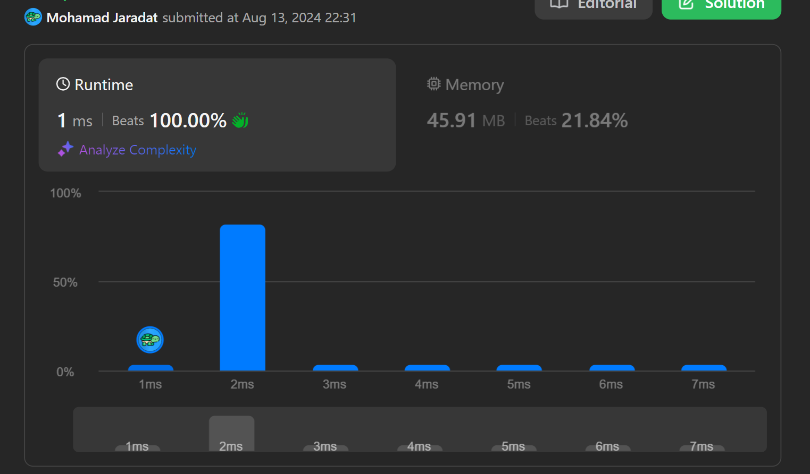

# Problem
- [Problem on LeetCode](https://leetcode.com/problems/balance-a-binary-search-tree/)



# Demo
Click on the video below or [here](https://drive.google.com/file/d/1MBHy-3H9QhqFoX3JJDS_eM-zqpknmHTe/view?usp=sharing) to watch a 27-seconds visualization of the solution once the unbalanced BST is traversed in order and stored in a list:

[](https://drive.google.com/file/d/1MBHy-3H9QhqFoX3JJDS_eM-zqpknmHTe/view?usp=sharing)

# Intuition
If we manage to store the tree nodes in a list in ascending order, then the middle-most node in the list divides the data into two parts (which are also sorted in ascending order).
This way we can use Divide & Conquer solution. Since the given tree is BST then traversing it *in order* will give us the sorted data in ascending order.

# Approach
- Traverse the given BST *in order* and store the tree nodes in a list (ArrayList for fast retrieval).
- Find the middle node `mid` in the list `[start=0, end= list.size()-1]`, and split the list into left and right halves:
    - Now the left child `mid.left` can be found at the middle of the left part: `[0, mid-1]`
    - And the right child `mid.right` can be found at the middle of the right part: `[mid+1, list.size()-1]`
    - Repeat the above steps recursively with smaller halves until the entire list was converted into an AVL BST.

# Complexity
- Time Complexity: ***O(N)***, `inOrderTraverse` method will iterate over a BST of `N` nodes and stores them in a list, so it takes ***O(N)***. `balance` method finds the node at the middle on constant time and divides the data in half with each iteration, which means ***O(Log N)***. Overall, `balanceBST` will take ***O(N)***.
- Space Complexity: ***O(N)***, the algorithm uses a list of `N` tree nodes.

# Code
## Java Sample
```java
class Solution {
    List<TreeNode> list = new ArrayList<>();
    public TreeNode balanceBST(TreeNode root) {
        inOrderTraverse(root);

        return balance(0, list.size()-1);

    }
    private void inOrderTraverse(TreeNode node){
        if(node == null)
            return;

        if(node.left !=null )
            inOrderTraverse(node.left);

        node.left = null;
        list.add(node);

        if(node.right !=null )
            inOrderTraverse(node.right);
        node.right = null;
    }
    private TreeNode balance(int start, int end){
        if(start > end)
            return null;
        if(start == end)
            return list.get(end);

        int mid = start + (end - start)/2;
        TreeNode root = list.get(mid);
        root.left =  balance(start, mid-1);
        root.right = balance(mid+1, end);
        return root;
    }
}
```
