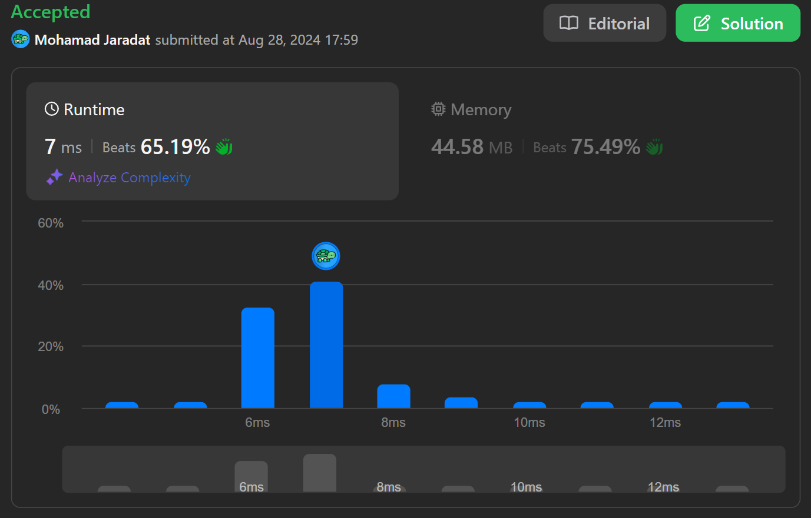

## Problem
https://leetcode.com/problems/top-k-frequent-words/

## Java Code
### Solution 1: Using HashMap & Max Heap

Pseudocode: 
* Step 1: Iterate over the array, and use a Hashmap to record the frequencies of each word in the array.
* Step 2: Add the words to a max heap, (comparisons in the heap should be based on frequencies of the words in the array, if two words have the same frequency, give a priority to the alphabetical ascending order).
* Step 3: Poll k elements from the heap, these elements are kth most frequent words, add them to a list and return the answer.
```java
class Solution {
    Map<String, Integer> map;
    PriorityQueue<String> heap;
    // This comparator implements the comparison mechanism mentioned in step 2.
    Comparator<String> comparator = (x, y) -> {
        // Sort in descending order (max heap), if two frequencies are equal, compare the strings in ascending order.
        int diff = map.get(y) - map.get(x);
        return (diff != 0)? diff: x.compareTo(y);
    };
    public List<String> topKFrequent(String[] words, int k) {
        // Step 1
        // Record the frequencies of each word in the given array.
        map = new HashMap<>();
        for(String word: words){
            map.put(word, map.getOrDefault(word, 0) + 1);
        }
        // Step 2
        // Add the words to a max heap.
        heap = new PriorityQueue<>(comparator);
        for(String word: map.keySet()){
            heap.offer(word);
        }
        // Step 3
        // Poll the k most frequent words from the heap to a list and return the answer.
        List<String> list = new LinkedList<>();
        while (k-- > 0) {
            list.add(heap.poll());
        }
        return list;
    }
}
```
### Solution 2: Using HashMap & K-sized Min Heap

Pseudocode:
* Step 1: Iterate over the array, and use a Hashmap to record the frequencies of each word in the array.
* Step 2: Build a k-sized min heap (comparisons in the heap should be based on frequencies of the words in the array in ascending order, if two words have the same frequency, give a priority to the alphabetical descending order):
  * Iterate over the words in the Hashmap, and only add words to the min heap if `heap size` is less than `K` or the current word's frequency is more frequent than the heap root:
    * If `heap size` becomes more than `K`, then poll the smallest element.
* Step 3: The heap now contains only the `K` most frequent words, but in ascending order, poll them from the heap into a list.
* Step 4: reverse the list and return it.
```java
class Solution {
    Map<String, Integer> map;
    PriorityQueue<String> heap;
    // This comparator implements the comparison mechanism mentioned in step 2.
    Comparator<String> comparator = (x, y) -> {
        // Sort in ascending order (min heap), if two frequencies are equal, compare the strings in descending order.
        int diff = map.get(x) - map.get(y);
        return (diff != 0)? diff: y.compareTo(x);
    };
    public List<String> topKFrequent(String[] words, int k) {
        // Step 1
        // Record the frequencies of each word in the given array.
        map = new HashMap<>();
        for(String word: words){
            map.put(word, map.getOrDefault(word, 0) + 1);
        }
        // Step 2
        // Add the words to a k-sized min heap.
        heap = new PriorityQueue<>(comparator);
        for(String word: map.keySet()){
            if(heap.size() < k || comparator.compare(word, heap.peek()) > 0){
                heap.offer(word);
                if (heap.size() > k) {
                    heap.poll();
                }
            }
        }
        // Step 3
        // Poll the k most frequent words from the heap to a list.
        List<String> list = new LinkedList<>();
        while (!heap.isEmpty()) {
            list.add(heap.poll());
        }
        // Step 4
        // reverse the list and return it.
        Collections.reverse(list);
        return list;
    }
}
```